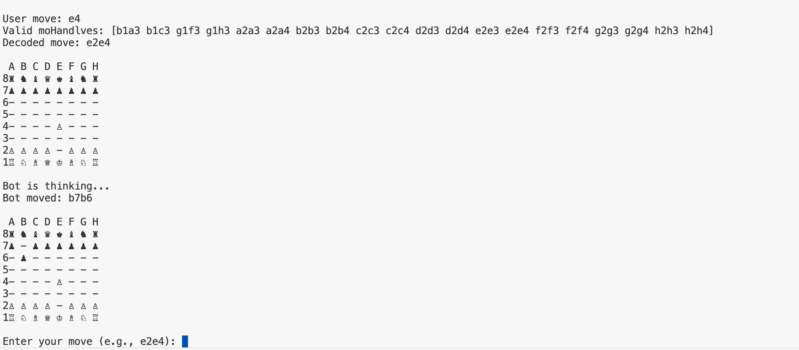

# Chess Game

## Description
A simple command-line chess game implemented in Go using the `github.com/notnil/chess` package. The game allows a user to play against a bot, with valid move validation and standard chess rules.

## Features
- Play as White against a bot opponent.
- Move validation based on standard chess rules.
- Displays the board state after each move.
- Uses Standard Algebraic Notation (SAN) for moves.

## Installation
Ensure you have Go installed on your system. Then, clone the repository and navigate to the project directory:

```sh
$ git clone https://github.com/yourusername/chess-game.git
$ cd chess-game
```

## Usage
Run the chess game using:

```sh
$ go run main.go
```

Follow the on-screen prompts to enter your moves in SAN format (e.g., `e4`, `Nf3`, `Bxc4`).

## Dependencies
- `github.com/notnil/chess`

Install dependencies using:

```sh
$ go mod tidy
```

## Example Gameplay
```
Enter your move (e.g., e4): e4
Bot is thinking...
Bot moved: d6
Enter your move (e.g., Nf3): Nf3
```

